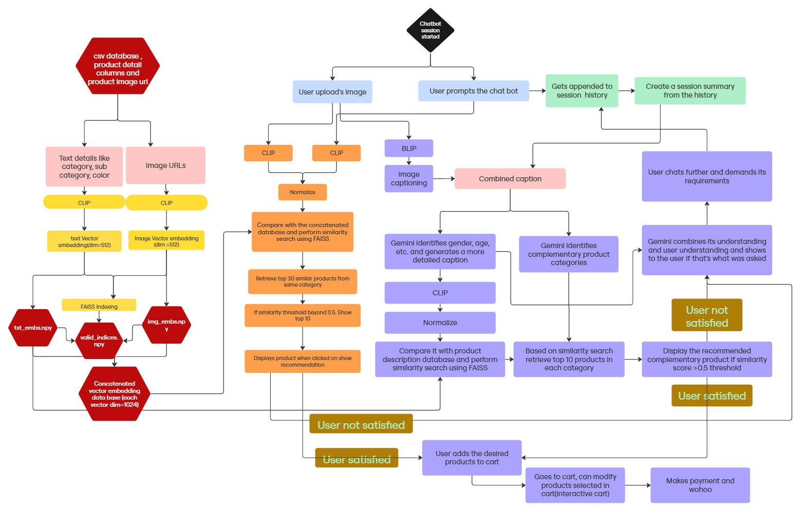

# 🛍️ ShopSmarter 🧠

An AI-Powered Personal Shopping Assistant for E-Commerce that combines Computer Vision, Recommendation Systems, and Conversational AI to enhance your shopping experience. 

Current recommendation system majorly uses CLIP, BLIP, FAISS.

## 🗂️ Project Structure

```
ShopSmarter/
├── client/                      # Frontend EJS application
│   ├── public/                  # Static assets
│   │   ├── css/                # Stylesheets
│   │   ├── js/                 # Client-side JavaScript
│   │   └── images/             # Image assets
│   └── views/                  # EJS templates
│       └── partials/           # Reusable template parts
│
├── server/                      # Express.js backend server
│   ├── controllers/            # Route controllers
│   ├── models/                 # Embedding Generator model
│   ├── routes/                 # API routes
│   ├── data/                   # Mock data and images
│   └── app.js                  # Main server file
│
└── MainRecommendationSystem/    # ML recommendation engine
```

## Flowchart



## 🚀 Setup Instructions

### System Requirements

-    Node.js (v22.11.0)
-    Python 3.9 or higher
-    GPU (recommended for better performance, but will run on CPU also)

### Python Dependencies

-    FastAPI
-    Uvicorn
-    PyTorch (>=1.10.0)
-    FAISS-CPU (>=1.7.2)
-    NumPy (>=1.21.0)
-    Pandas (>=1.3.0)
-    Pillow (>=8.3.0)
-    Transformers (>=4.30.0)
-    Google Generative AI (>=0.3.0)
-    Requests (>=2.26.0)
-    PyQt5 (>=5.15.0)

### Node.js Dependencies

-    Express.js
-    EJS
-    Axios
-    Dotenv
-    Express-session

### Backend Setup (Server)

1. Install Node.js dependencies:

```bash
npm install
```

2. Install python packages:

```bash
pip install -r requirements.txt
```

3. Then, to start both the servers:

```bash
.\start_servers.bat
```

for windows and

```bash
.\start_servers.zsh
```

for mac

This will start the node server in port 5000 and the python server in port 5001 and automatically open the website in locahhost:5000.

### Recommendation System Setup (This was used earlier for Round 2. Not in use now)

1. Create and activate a Python virtual environment:

```bash
python -m venv env
source env/bin/activate  # On Unix/macOS
# or
env\Scripts\activate     # On Windows
```

2. Navigate to the recommendation system directory:

```bash
cd MainRecommendationSystem
```

3. Install Python dependencies:

```bash
pip install -r requirements.txt
```

4. Start the recommendation service:

```bash
python service.py
```

## 🎯 Key Features

✨ **Image Uploads**

-    Upload photos of products (clothes, accessories, furniture, gadgets)
-    Supported formats: JPG, PNG, WEBP

🧠 **Visual Understanding**  
AI models analyze images to extract:

-    Color schemes
-    Textures
-    Product categories
-    Style attributes
-    Brand characteristics

🔁 **Smart Recommendations**

-    Similar product suggestions
-    Complementary item recommendations
-    Style-based matching

❤️ **Personalized Shopping**  
Recommendations adapt based on:

-    User preferences
-    Shopping history
-    Style choices

💬 **Multimodal Interaction**  
Natural language queries with image support:

-    "Show me similar jackets"
-    "Find matching accessories"
-    "What goes well with this?"

🔉 **Audio integrated**

-    The AI assistant will read out the suggestions for the user
-    The user gets real shopping feel

*    <i> For using this feature, turn on the sound setting for this website in the browser</i>

### <b><u>NOTE:</b></u> <i>For everyone to use the payment page, the common username is "username" and password is "password".</i>

## 👥 Team HSM

-    Hemanth
-    Shaurya
-    Smitali
-    Mothish
