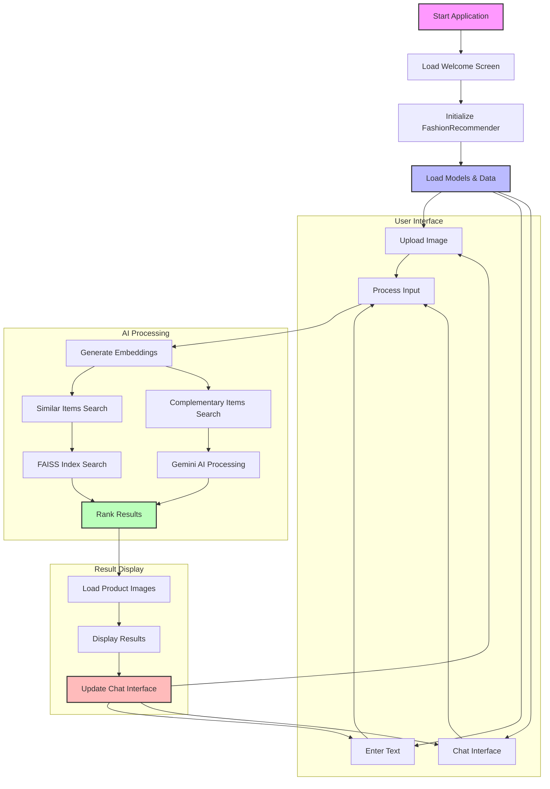

## Process Flow Explanation

1. **Application Initialization**
   - Application starts and loads the welcome screen
   - FashionRecommender is initialized
   - Required AI models and data are loaded

2. **User Input Processing**
   - Users can interact through three main channels:
     * Image upload
     * Text input
     * Chat interface
   - All inputs are processed through the AI pipeline

3. **AI Processing Pipeline**
   - Input is converted to embeddings using CLIP
   - Two parallel processes:
     * Similar items search using FAISS
     * Complementary items using Gemini AI
   - Results are ranked and combined

4. **Result Display**
   - Product images are loaded asynchronously
   - Results are displayed in a grid layout
   - Chat interface is updated with recommendations
   - User can continue interaction

5. **Feedback Loop**
   - User can provide feedback through chat
   - System can refine recommendations
   - Process can be repeated with new inputs 